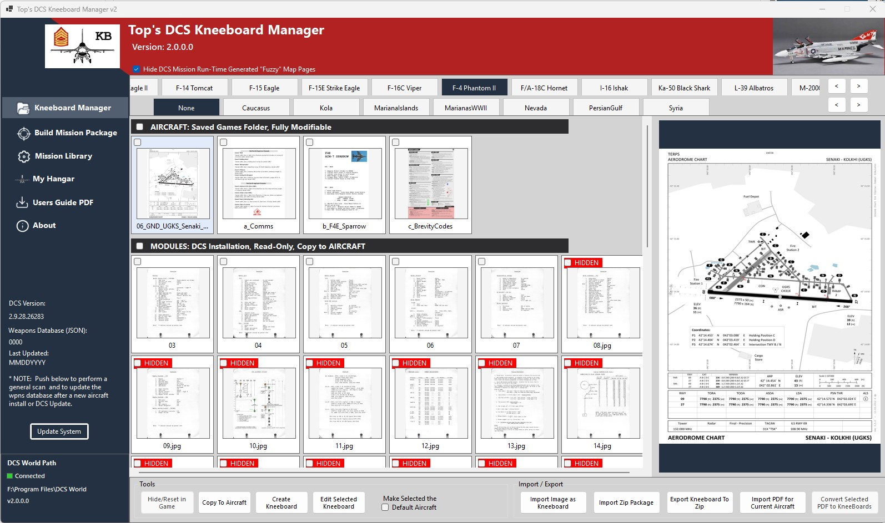
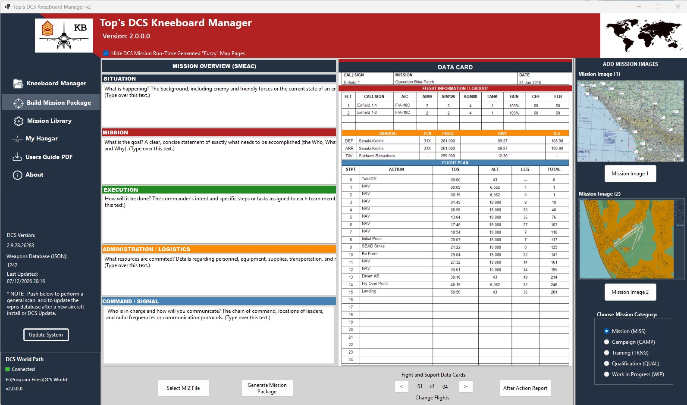
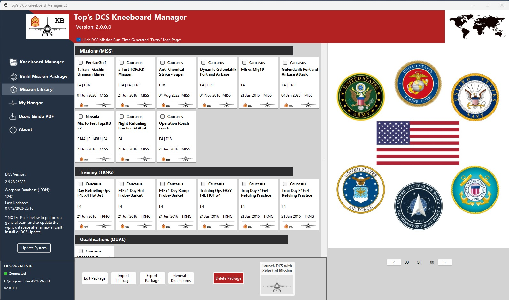
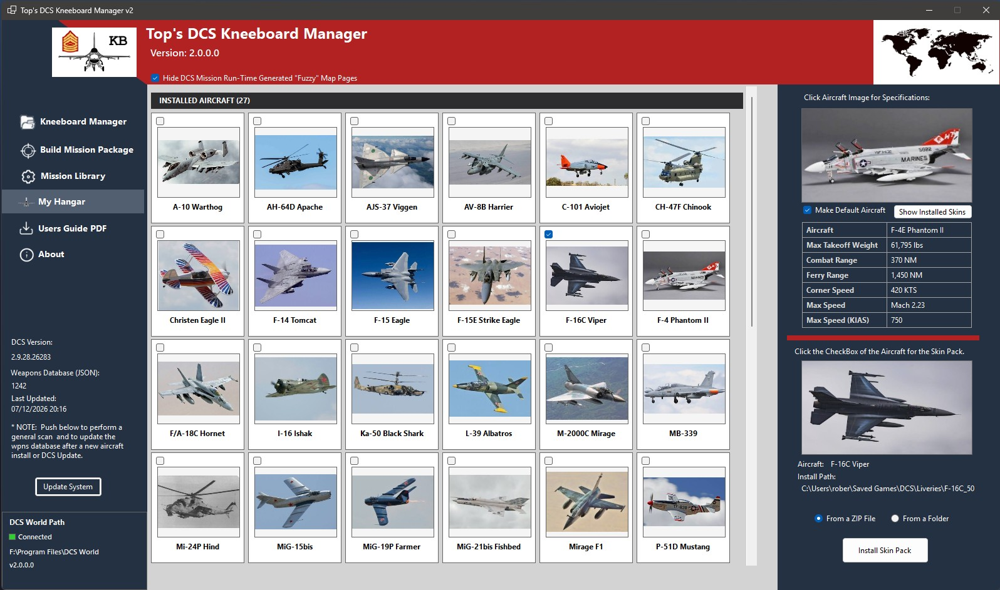

# TopDCSKneeBoard v2

TopDCSKneeBoard is a Windows application designed for Digital Combat Simulator (DCS World) pilots. It simplifies kneeboard management and automates the creation of mission briefing materials, allowing pilots to spend more time flying and less time preparing.

## Download

Download the latest version of TopDCSKneeBoard from the **Releases** page.

**➡️ [Download the Latest Release](../../releases/latest)**

## Features

- Manage kneeboard pages for all installed DCS aircraft
- Create complete Mission Packages from DCS mission (.miz) files
- Automatically generate:
  - Data Cards
  - Flight Plans
  - Airbase Information
  - Waypoint Summaries
  - Mission Briefing (SMEAC) Cards
- Mission Library for organizing mission packages
- My Hangar for managing installed aircraft liveries
- Install aircraft skins from folders or ZIP files
- Supports modern DCS World installations
- Self-contained Windows application (no .NET installation required)

---

## System Requirements

- Windows 10 or Windows 11
- Digital Combat Simulator (DCS World)
- Screen resolution of 1920×1080 or higher recommended

---

## Installation

1. Download the latest installer from the **Releases** page.
2. Run the installer.
3. Launch **TopDCSKneeBoard**.
4. On first launch, configure the location of your DCS installation if prompted.

---

## Documentation

The complete User Guide is included with the installer and is also available in the Releases section.

---

## Support

If you encounter a bug or have a feature request, please open an Issue in this repository.

When reporting a problem, please include:

- TopDCSKneeBoard version
- DCS World version
- Windows version
- Steps to reproduce the issue
- Screenshots or log files (if applicable)

---

## Screenshots

### Kneeboard Manager

### Build Mission Package

### Mission Library

### My Hangar

---

## Credits

Created by **Top B**

Special thanks to the DCS community for testing, feedback, and ideas that helped shape this project.

---

## Disclaimer

Digital Combat Simulator (DCS World) is a product of Eagle Dynamics SA.

TopDCSKneeBoard is an independent community project and is not affiliated with or endorsed by Eagle Dynamics.
